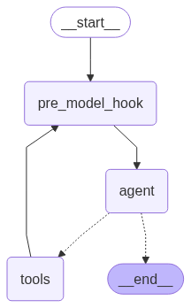
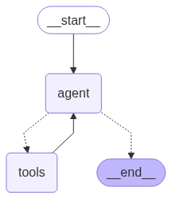

# learn-ai


This application provides backend API endpoints to access various AI chatbots.

**SECTIONS**

1. [Initial Setup](#initial-setup)
2. [Configuration](#configuration)
3. [Committing & Formatting](#committing--formatting)
4. [Sample Requests](#sample-requests)
5. [Langsmith Integration](#langsmith-integration)
6. [Architecture Overview](#architecture-overview)

## Initial Setup

Learn-AI follows the same [initial setup steps outlined in the common OL web app guide](https://mitodl.github.io/handbook/how-to/common-web-app-guide.html).
Run through those steps **including the addition of `/etc/hosts` aliases and the optional step for running the
`createsuperuser` command**.

- The backend app runs locally on port 8005.
- A simple frontend sandbox runs at port 8003.

You can start it by running `docker compose up`

## Configuration

Configuration can be put in the following file which is gitignored:

```
mit-learn/
  ├── env/
      ├── backend.local.env
      └── frontend.local.env
```

You will need at minimum the following environment variable to run locally:

```
# In backend.local.env
OPENAI_API_KEY=<your_openai_api_key>
```

### Frontend Configuration

Some parts of the frontend sandbox are query OpenEdx APIs. In lieue of a localally running OpenEdx instance in-sync with a Learn instance, you can proxy OpenEdx requests to an RC instance. For this to work, you must add `OPENEDX_SESSION_COOKIE_VALUE` to your `frontend.local.env` file. See `frontend.env` for details.

## Committing & Formatting

To ensure commits to GitHub are safe, first install [pre-commit](https://pre-commit.com/):

```
pip install pre_commit
pre-commit install
```

Running pre-commit can confirm your commit is safe to be pushed to GitHub and correctly formatted:

```
pre-commit run --all-files
```

To automatically install precommit hooks when cloning a repo, you can run this:

```
git config --global init.templateDir ~/.git-template
pre-commit init-templatedir ~/.git-template
```

## Sample Requests

Run the following curl command to test the HTTP recommendation agent API:

```
curl 'http://ai.open.odl.local:8002/http/recommendation_agent/' \
  -H 'Accept: */*' \
  -H 'Connection: keep-alive' \
  -H 'Origin: http://ai.open.odl.local:8002' \
  -H 'Referer: http://ai.open.odl.local:8002/' \
  -H 'User-Agent: Mozilla/5.0 (Macintosh; Intel Mac OS X 10_15_7) AppleWebKit/537.36 (KHTML, like Gecko) Chrome/131.0.0.0 Safari/537.36' \
  -H 'accept-language: en-US,en;q=0.9' \
  -H 'content-type: application/json' \
  --data-raw '{"message":"I am curious about AI applications for business"}' \
  --verbose
```

## Langsmith Integration

[Langsmith](https://smith.langchain.com) can be used to manage the AI agent prompts and monitor their usage, costs, and outputs.
To enable this functionality, you need to perform the following steps:

1. Create a free Langsmith account and obtain an API key.
2. Add the following to your backend environment variables:
   ```
   LANGSMITH_TRACING=true
   LANGSMITH_API_KEY=<your_api_key>
   LANGSMITH_ENDPOINT=https://api.smith.langchain.com
   LANGSMITH_PROJECT=<any_project_name_you_want>
   ```

On the langsmith UI, there is a "Prompts" menu button on the left side that will load a list of
them. Each environment will have its own set of prompts (each prompt will have a "\_dev/rc/prod"
suffix). If you click on one for details, there will be an "Edit in Playground" button at top
right that will let you make/test changes. The prompts are cached in redis so if changes are
made and you want them to take effect right away, you can run a new `clear_prompt_cache` management
command.

If you need to update a prompt, you have 2 options:

- Update it directly from the LangSmith prompt UI
- Use the "update_prompt" management command (ex: `./manage.py update_prompt --prompt syllabus`). If the
  prompt already exists in LangSmith and has a different value, you will need to manually confirm
  the change. This may happen if someone had editied the prompt in the Langsmith UI, in which
  case you should consult with the editor, merge the changes together into the hardcoded `prompts.py`
  value, and then run the management command again.

## Architecture Overview

### Client-Server communication

Interaction between users and AI agents is handled via [Django Channels](https://channels.readthedocs.io/en/latest/) (which allows for asynchronous communication), in particular the [AsyncHttpConsumer](https://channels.readthedocs.io/en/latest/topics/consumers.html#asynchttpconsumer) class. `AsyncHttpConsumer` can handle streaming responses asynchronously so as not to block other requests.

The bulk of the relevant code for this is in the `ai_chatbots.consumers` module. Each chatbot agent has a corresponding consumer class that inherits from the BaseBotHttpConsumer class which provides common functionality. The most important functions are as follows:

- `create_chatbot`: not implemented in the base class; instantiates a chatbot agent of the appropriate type.
- `process_message`: serialize the JSON request data from the client
- `assign_thread_cookies`: determine via cookies which "thread" (ie chat session) that the user request is a part of (may be a new or existing session).
- `prepare_response`: determine which user and chat session this request is intended for, and set up a django channel layer for the response
- `start_response`: assign required headers for a streaming chunked response.
- `create_checkpointer`: Create an instance of a "checkpointer" - a langgraph term for an object that manages and stores all messages (human and AI) that make up a chat session. Currently this is always a custom `AsyncDjangoCheckpointer` class which uses the Django ORM to save chat session messages.
- `handle`: the main function of any `AsyncHttpConsumer` class. It executes the functions mentioned above, sends the user message to the chatbot agent, streams back its response, handles errors if necessary, then closes the channel connection.

Currently there are four consumer classes for each of the four different chatbot agents:

- `RecomnmendationBotHttpConsumer` -> `ResourceRecommendationBot`
- `SyllabusBotHttpConsumer` -> `SyllabusBot`
- `VideoGPTBotHttpConsumer` -> `VideoGPTBot`
- `TutorBotHttpConsumer` -> `TutorBot`

### Chatbot Agents

The education-focused AI chatbots mentioned above located in the `ai_chatbots.chatbots` module. They are built on the [LangGraph framework](https://langchain-ai.github.io/langgraph/concepts/why-langgraph/), which enables the construction of simple to advanced agentic logic workflows.

Langgraph workflows, or ["graphs"](https://langchain-ai.github.io/langgraph/concepts/low_level/), are defined by ["nodes"](https://langchain-ai.github.io/langgraph/concepts/low_level/#nodes) - typically large language models (LLM's) such as OpenAI's GPT or Anthropic's Claude - connected by ["edges"](https://langchain-ai.github.io/langgraph/concepts/low_level/#edges) that determine how data - ["state"](https://langchain-ai.github.io/langgraph/concepts/low_level/#state) - is passed between the user and the node(s) that make up the graph. Some nodes can be "tools" (i.e. functions) that perform tasks like retrieving data from an external search API and then return results back to another node.

Each of the chatbot classes in the `ai_chatbots.chatbots` module is actually a functional wrapper around an agent workflow/graph that manages various traits affecting the behavior of the graph: the LLM model to use, system prompt, new or existing "thread" (chat session), available tools, etc.

The base class from which all the chatbots inherit is `BaseChatbot` which provides some core functions, that are customized for each chatbot type:

- `get_llm`: instantiates an LLM via the `ChatLiteLLM` class which allows for interopability between numerous
  LLM providers.
- `create_tools`: specifies the list of tools (functions) if any that the graph node(s) will have access to. These tools are generally defined in the `ai_chatbots.tools` module.
- `create_agent_graph`: defines the agent graph. This will be explained in detail further below.
- `get_completion`: invokes the graph and yields its response chunk by chunk.

The current chatbot classes that inherit from this base class are:

- `ResourceRecommendationBot` - find MIT learning resources that match a user's interests based on their feedback and background. This bot makes use of a tool to query the MIT Learn resource vector search API.
- `SyllabusBot` - answer user questions about specific courses, programs or other learning resources. This
  bot uses a tool that queries the MIT Learn contentfile vector search API, filtering by the readable_id of
  the resource.
- `VideoGPTBot` - answers questions about a specific EdX course video. The chatbot calls a tool which searches the MIT Learn contentfile vector search API, using a filter based on a provided edx module id and video transcript block id.
- `TutorBot` - Provides assistance to users working though EdX course problem sets. The graph, tools, and prompts for this chatbot are primarily defined in an external repository - [open-learning-ai-tutor](https://github.com/mitodl/open-learning-ai-tutor/)

#### Agent graphs

The `BaseChatbot class explicittly defines a sample graph made up of an LLM node, tool node, and the edges connecting them. It is intended only as a reference to provide some guidance on how to construct your own.

Most of the implemented chatbots (Recommendation, Syllabus, VideoGPT)
make use of langrgaph's [create_react_agent](https://langchain-ai.github.io/langgraph/reference/agents/#langgraph.prebuilt.chat_agent_executor.create_react_agent) helper function which creates an agent graph that calls tools in a loop as needed, and provides the option for a "pre_model_hook" that can call functions or nodes before each call to the main LLM node.

For these bots, that hook is a summarization node (defined in `ai_chatbots.api`). When the number of tokens making up a message exceeds a certain threshold, a summary of the conversation is generated, replacing most of the previous individual messages. This helps reduce both the cost and response time of LLM calls. This graph can be visualized in a django shell as follows:

```python
from ai_chatbots.chatbots import *
from IPython.display import Image

rec_bot = ResourceRecommendationBot("recommender") # or any other bot
rec_graph = rec_bot.create_agent_graph()
Image(rec_graph.get_graph().draw_mermaid_png())
```



The Tutorbot's graph is defined in the [open-learning-ai-tutor](https://github.com/mitodl/open-learning-ai-tutor/) repository:

```python
from open_learning_ai_tutor.tutor import Tutor
from unittest.mock import MagicMock
from IPython.display import Image

tutor_graph = Tutor(MagicMock())
Image(tutor_graph.app.get_graph().draw_mermaid_png())
```



#### Agent tools

The tools that you define for use by an agent graph should include the following:

- Descriptive docstrings for the function that help an LLM understand how it should be used.
- A schema class (based on the pydantic `BaseModel` class) with descriptive docstrings that tells the LLM what the required/optional parameters for the tool are and what their valid values can be.

#### Agent system prompts

The default prompts used for each chatbot are specified either in Langsmith if enabled (see the [langsmith integration](#langsmith-integration) section above), otherwise the values in the `ai_chatbots/prompts` module are used. They are retrieved (and can be overridden) during the `__init__` call of each chatbot class.
