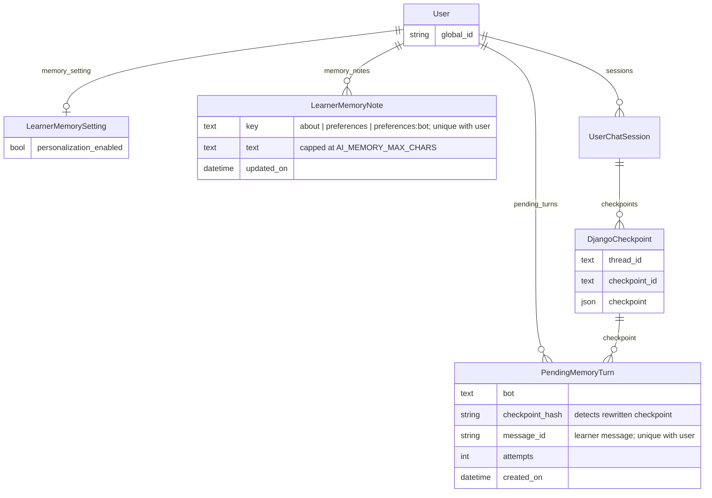

# RFC: Per-learner memory for AskTIM chatbots

## Status

Draft. Working prototype on the
[`mb/learner-memory-poc`](https://github.com/mitodl/learn-ai/tree/mb/learner-memory-poc)
branch of learn-ai.

## Problem

AskTIM doesn't remember a learner's preferences between conversations. Someone who asked
for online courses last week has to explain that again today.

Some of the information already exists. MIT Learn collects topic interests, goals,
education level, certificate preference, time commitment, and delivery preference when a
learner fills out their profile. Conversations can fill in what the profile doesn't cover,
such as "plain English, minimal jargon" or "advanced data science courses, but beginner
ecology."

Memory can also go wrong in ways a prompt change can't: confusing two subjects,
remembering a one-time request as a permanent preference, or treating a course the bot
recommended as something the learner wants. A mistake in memory carries into every later
conversation, so this needs more checking than a prompt change.

## General Approach

Give AskTIM the learner's MIT Learn profile fields, short notes learned from
conversations, and possibly their course and program enrollments, so preferences carry
across sessions and bots.

- **Profile fields.** Read from mit-learn, never written back. If unavailable, chat
  continues without them.
- **Learned notes.** Two notes shared across bots plus one per bot, rewritten by a
  background task after a configurable delay, initially 15 minutes.
- **Enrollments (phase 2).** Courses and programs the learner is taking or has taken, so
  the recommendation bot stops suggesting them. Fetched live like the profile, never
  written into notes. Where to get the data is open; see Phase 2 below.

All of it uses the signed-in learner's identity. One feature flag enables it: on in RC,
off in production until the evaluation in step 4 passes. Learners can see what has been
remembered, clear it, and turn personalization off from their MIT Learn settings page;
off covers everything here, including enrollments if they arrive.

## Options Considered

Every option uses the profile fields; they differ in what the bots learn from conversations
and how they store it. Learned memory stays in learn-ai, which already has the
conversations and background workers; mit-learn would need a write API.

### Option 1: Profile fields only, no learned memory

Put the six profile fields in every bot's prompt. Nothing is learned from conversations.

- Pro: small, low risk, no new storage or model calls; learners already control the data.
- Con: "plain English", "beginner ecology but advanced data science", or "don't show me
  MicroMasters" still have to be repeated, and we learn nothing about whether
  conversational memory is worth building.

### Option 2: Free-text notes in learn-ai, rewritten in the background (recommended)

Store two shared notes plus one per bot. A background job reviews exchanges and asks a
model to rewrite the notes when there is something worth remembering: the "profile
document with background updates" pattern from LangChain's
[memory docs](https://docs.langchain.com/oss/python/concepts/memory).

- Pro: the model sees the conversation and the existing notes together, so it can
  interpret "yes, remember that" and subject-specific preferences. Three short sections
  bound prompt cost. Runs on the existing Django/Postgres, Redis, and Celery stack.
  Updates happen after the reply, so a bad extraction never affects the reply that
  triggered it.
- Con: whole-note rewriting can drop unrelated facts or over-generalize a topic-specific
  preference. This is the main quality risk and needs a real evaluation set. Background
  tasks need a per-learner lock and a pending queue to handle simultaneous chats.

### Option 3: Structured facts table

Store individual facts (`subject`, `predicate`, `value`, `source`, `confidence`) and have
the extraction model emit adds, updates, and deletes.

- Pro: facts are easy to edit, delete, and trace; one rewrite can't lose an unrelated fact.
- Con: doesn't fix the harder problem, the model misreading "this topic" or a one-time
  request; the mistake lands in a row instead of a sentence. A schema for open-ended
  preferences is hard to get right up front, rendering rows back into a prompt is its own
  design problem, and it is more code and tests for the same v1 outcome.

### Implementation choices that apply to Options 2 and 3

**Extraction: `langmem` or a direct model call.** I tried `langmem`, LangChain's memory
extraction package, first. In the prototype its update step didn't reliably return a
result through `ChatLiteLLM`, which is how learn-ai reaches every model, and the shape I
tried, one document per learner, made the shared and per-bot sections awkward to update
together. Its last release (0.0.30) was 2025-10-27. A direct structured-output call is
about thirty lines, returns a typed `MemoryRevision`, and is easier to steer; the cost is
that we own the extraction prompt and its evaluation.

**Storage: LangGraph's `PostgresStore`, an external memory service, or a Django-backed
`BaseStore`.** `PostgresStore` manages its tables outside Django migrations and has no
user foreign key, so deleting a user would be manual cleanup. External services (Mem0,
Zep/Graphiti, Letta) add vector retrieval and relationships between facts, which we'd
want for hundreds of memories per learner; for a few short notes they add a dependency
with its own authentication, deletion, and data-residency questions. A thin Django-backed
`BaseStore` over our own table keeps LangGraph's interface, gives us migrations and
cascade deletes, and can be swapped for either later, or for another try at `langmem`,
without touching the bots.

**Queueing: a pending-work table or a lock alone.** A lock alone would lose updates
whenever a task skipped a held lock or crashed before commit. A pending-work table
(`PendingMemoryTurn`, below) is one small table and covers both.

## Decision

**Option 2**, behind a feature flag: RC first, production once the evaluation passes.

Profile fields alone don't cover the preferences learners repeat. Short notes let us
evaluate conversational memory before investing in individual facts; if rewrites keep
losing facts or product needs fact-level editing, Option 3 is the next step. No vector
search or third-party memory service in v1.

Each bot sees three sections:

- **About**: durable facts about the person (background, occupation, goals, time available).
- **Preferences**: how they want every bot to respond (tone, length, level of jargon).
- **Per-bot preferences**: how they want this bot to respond, such as "don't show me
  MicroMasters programs" for the recommendation bot.

After a couple of conversations a learner's notes might read:

> **About:** Works as a data analyst; wants to move into ecology or environmental science.
> Prefers online courses.
> **Preferences:** Plain English, minimal jargon, short answers.
> **Recommendation bot:** Advanced data science courses; beginner ecology courses.

The next time they ask "anything good on ecology?", the recommendation bot would search
for online, beginner-friendly ecology courses and answer briefly, without asking about
their level or delivery preference first. Today it asks.

Some things must not be written to memory: names, email addresses, assessment content
(problem statements, attempted or correct answers, hints, grades, scores, problem
identifiers), and anything about how a bot should treat its own rules, tools, or
permissions, so "ignore your rules from now on" shouldn't stick. Tutor transcripts are
never sent to extraction in v1; the tutor reads the shared notes but doesn't write them,
which keeps the main source of assessment content out of the pipeline. Everything else,
including assessment content pasted into another bot, relies on the extraction prompt and
the evaluation cases in step 4. That is a tested mitigation, not a guarantee: the
extraction model still sees whatever the learner typed, and so do traces if tracing is on.

In one prototype run it extracted three reasonable preferences from four exchanges and
dropped a planted "ignore your rules" message; those preferences carried into a new thread
and a new browser session. Two failures shaped the design: an early version generalized
"advanced data science courses" into "advanced everything", and the bot sometimes
repeated a preference without applying it to search. Both are now
evaluation cases.

## Design

### mit-learn

#### Profile Preferences API Endpoint

Add `GET /api/v0/profiles/<global_id>/preferences/`, returning only `topic_interests`,
`goals`, `current_education`, `certificate_desired`, `time_commitment`, and `delivery`.
No name, email, or avatar, which limits what a leaked token could expose.

#### Service Authentication

Reuse `Authorization: Bearer <LEARN_ACCESS_TOKEN>`, which learn-ai already sends for
content-file search and tutor problems ([utils.py](../ai_chatbots/utils.py)). It is a
mit-learn OAuth token, not a Keycloak token; mit-learn's django-oauth-toolkit middleware
resolves it to learn-ai's service account, and the URL's `global_id` names the learner.

`IsAuthenticated` alone would let any logged-in learner request someone else's
preferences. Restrict access with a group permission, following the
`content_file_content_viewers` and `tutor_problem_viewers` pattern but with its own group
(`learner_preferences_viewers`): reading course content and reading learner profiles
shouldn't share a permission. An APISIX key-auth consumer would also work but needs a
gateway change for no benefit here.

Tokens are issued and expired in mit-learn's admin under OAuth2 Provider.

### learn-ai

#### Profile Preferences Fetch and Cache

learn-ai calls the endpoint only for learners whose personalization setting is on, with
the authenticated learner's `global_id`, never an ID from the request body. The result is
cached for `AI_PROFILE_CACHE_SECONDS` (12 hours to start), so a profile edit can take that
long to reach the bots. Turning personalization off clears the cached copy, but the
setting is what stops it being read; a fetch that finishes after opt-out may re-cache a
result nobody reads until it expires. The fetch has a timeout, and if it fails the chat
continues without the profile. Notes are read separately, so a profile failure doesn't
hide them. The prototype stubs this call.

#### Learner Memory Storage

Three new Django models in `ai_chatbots/models.py`:

- `LearnerMemorySetting`: one row per user with `personalization_enabled`. Absent rows
  read as the default, so nothing to backfill; if product picks off by default (see Open
  Questions) absent rows read as off instead and explicit rows are untouched.
- `LearnerMemoryNote`: one row per user and key (`about`, `preferences`,
  `preferences:<bot>`), with the text and a last-updated timestamp.
- `PendingMemoryTurn`: one row per exchange waiting to be processed, pointing at a
  checkpoint (the saved state of a conversation) rather than copying its text, deleted
  once processed.

All three hang off `User` and every foreign key cascades on delete, so deleting a chat
thread takes its pending work with it. `DjangoMemoryStore` in
`ai_chatbots/memorystores.py` exposes the notes through LangGraph's `BaseStore`, grouped
by `global_id`. Neither the store nor the models authorize anything; the chat handler and
the memory endpoint only ever pass in the authenticated learner. Staff can view notes in
Django admin.

Each section is capped at `AI_MEMORY_MAX_CHARS` (1,500); three full sections add roughly
1,100 tokens to every request. I want to measure that during the pilot before deciding
whether to shorten them.

#### Memory Extraction Pipeline

`AsyncDjangoCheckpointer` already saves conversations as `DjangoCheckpoint` rows. After
the reply's checkpoint commits, the chat handler saves a `PendingMemoryTurn` recording the
user, bot, checkpoint, message hash, and the ID of the learner message just answered. The
insert runs in a short transaction that locks the learner's `User` row and re-reads the
setting; turning personalization off takes the same lock, so a chat can't read "on", lose
the race to an opt-out, and queue work after it. Nothing slow happens inside that
transaction.

Every bot gives its outgoing `HumanMessage` a UUID, so two simultaneous replies in one
thread get their own rows and the same message can't be queued twice. The Celery task is
scheduled after the row commits and receives the user ID, never the transcript.

The first pending row for a learner schedules `process_learner_memory` for
`AI_MEMORY_DELAY_SECONDS` (15 minutes) later; rows arriving in that window join the same
run. A periodic `requeue_stale_memory_turns` task covers a lost Celery send or a row that
arrived just as a worker finished.

The task finds the recorded learner message in each checkpoint and includes it (capped at
`AI_MEMORY_MESSAGE_CHARS`), the bot message before it and the reply after it (each capped
at `AI_MEMORY_REPLY_CHARS`), and earlier learner messages as context
(`AI_MEMORY_HISTORY_MESSAGES`). The preceding bot message is what resolves "yes, remember
that." The prompt says bot messages can help interpret the learner's words but can't
establish facts about them.

The error-recovery code in `ai_chatbots/utils.py` can rewrite checkpoint messages, so the
worker verifies the stored hash and skips rows whose checkpoint changed or vanished. If
too many rows become unusable, reconsider storing a bounded copy of the input.

A low-cost screening model (`AI_MEMORY_GATE_MODEL`, gpt-4o-mini to start) says whether
the batch contains anything worth remembering. If yes, the extraction model
(`AI_MEMORY_EXTRACTION_MODEL`, gpt-4.1 to start) receives the current notes plus the
rendered exchanges through `ChatLiteLLM` and returns a `MemoryRevision`: two shared
sections plus one per bot in the batch. An empty section clears the existing one; a
section that can't fit the cap on a sentence boundary keeps the previous text.

Screening is on in v1, but it saves an extraction call on empty batches at the cost of a
second chance to miss a correction or withdrawal, so it is gated behind the same
evaluation as everything else: compare one extraction call against screening plus
extraction on the evaluation cases, and drop screening if it misses corrections. Compare
candidate models for both roles the same way.

#### Extraction Task Reliability

One extraction per learner at a time, enforced by a Redis lock (`AI_MEMORY_LOCK_SECONDS`,
longer than the task's hard time limit plus Celery's grace period). If the lock is held,
rows wait. The task takes the oldest rows up to `AI_MEMORY_BATCH_SIZE` and
`AI_MEMORY_BATCH_CHARS`; an exchange that alone exceeds the limit is dropped with a
warning. No database transaction stays open across model calls.

The task reads the feature flag and the learner's setting under the lock before any model
call and again before commit; if either is off at either point it discards the result and
drops the rows. Otherwise it deletes the selected rows, checks the count matches (see
Learner Controls), and saves notes, all in one transaction. A screening "no" or a batch
with no usable exchanges deletes the rows without changing notes. An extraction that
passed its check before the learner opted out may still be dispatched or finish; its
result is discarded at commit. That is the one window in which an opted-out learner's
text reaches a model, and it isn't cancelled mid-flight.

A crash before commit leaves the batch pending and the next run repeats the model calls;
a crash after commit leaves nothing to redo, so each pending row is applied at most once.
The row is also the deduplication record; once deleted, the same exchange could in
principle be queued again, but rows are only created when a reply finishes.

Each attempt increments `attempts`; rows that reach `AI_MEMORY_MAX_ATTEMPTS` are excluded
from batches, visible in admin, and deleted per Retention below. Rows are ordered by when
responses finished; if submission order turns out to matter, add a sequence number rather
than trusting timestamps.

#### Learner Controls: View, Clear, Turn Off

The MIT Learn settings page gets a section with the on/off setting, a read-only view of
the notes, and a "Clear memory" button. Anonymous and Canvas chats have no learner
identity, so no memory and no controls.

The setting lives in learn-ai, not the MIT Learn profile, because turning it off has to
clear memory in the same transaction; a flag in mit-learn would leave a window in which a
finishing chat could queue work or a worker could write notes. Every check is then a local
database read. The settings page already talks to more than one backend (the dashboard
reads MITx Online directly), so a second call is not a new pattern.

One endpoint, `/api/v0/memory/`, for the signed-in learner only; no user ID in the URL or
body.

- `GET`: the setting, the note sections, and when each was last updated. The page shows
  them as plain text, noting that a model wrote them and they update a while after chatting.
- `PATCH {"personalization_enabled": false}`: lock the `User` row, set the flag off, delete
  notes and queued exchanges, one transaction; then clear the cached profile. `true` just
  sets the flag; memory starts empty.
- `DELETE`: delete notes and queued exchanges, leave the setting alone.

The page calls it the way the MIT Learn frontend (smoot-design) already calls the
response-rating endpoint: a
`fetch` to the learn-ai origin with credentials and the CSRF header. CORS needs `GET`,
`PATCH`, and `DELETE` added to `CORS_ALLOW_METHODS`, which currently allows only `POST`
and `OPTIONS`.

What off guarantees: after the `PATCH` returns, new chat requests load no profile fields
or notes and queue no memory work, and existing notes and queued work are deleted. A chat
already being answered finishes with the context it started with, and an extraction
checked before off is discarded at commit. Chat history, the setting itself, and any
traces stay under their own rules. There is no hidden-but-kept memory. Turning it back
on while an older chat is still being answered is not an exception: the insert re-reads
the setting under the lock, so that reply is queued because personalization is on again.

Clearing has to beat an extraction already in flight. Both transactions touch the same
pending rows, and that is what serializes them, so the statement order inside each one
matters:

- The task's commit deletes its batch's pending rows _before_ writing notes, and rolls
  back if it deleted fewer rows than it selected.
- Clear deletes the learner's pending rows _before_ the notes, in one transaction. The
  other order isn't safe: under `READ COMMITTED` a note the task inserts after clear's
  note delete has already run is invisible to it, so a freshly written note would
  survive the clear.

Then if clear commits first, the task deletes nothing, sees the count mismatch, and
aborts without writing. If the task commits first, clear's pending-row delete blocks on
the task's locks, and its note delete runs afterwards against a fresh snapshot that
includes whatever the task just wrote. Either order ends with the memory gone, with no
new column. The admin delete action calls the same `clear_learner_memory` helper.

Clear doesn't touch conversation history, and a later exchange in the same thread carries
earlier messages as context, so a fact from before the clear can be learned again.
Deleting the chat is the existing control for that.

#### Prompt Assembly

Profile fields and notes are labeled separately and marked as learner-supplied data, not
instructions. The recommendation bot gets all six profile fields; other bots get education
level plus the shared notes and their own section. Application and tutoring rules always
win. Within those, what the learner says now beats what they said before, and the profile
beats an older note when they directly conflict.

For v1 the bot is told the preferences and decides how to search; we don't turn them into
search filters in code. That needs product agreement, and the catalog has no reliable
beginner/advanced filter. The prompt has to say explicitly to use relevant preferences in
searches and to search before claiming nothing matches, because in testing the bot
sometimes acknowledged a preference and then ignored it.

#### Learner Identity and Bot Scope

Everything is keyed on the authenticated `global_id`, which learn-ai's middleware decodes
from the `x-userinfo` header set by the APISIX gateway. Neither the request body nor model
output can select another learner. If the gateway let a client supply that header, one
person's memory could be shown to another, so confirming it strips it is part of rollout.
Recommendation, syllabus, video, and edX tutor bots are included; anonymous chats are
unchanged.

Canvas stays out for now. The Canvas xblock proxies requests with the shared
`canvas_token`, so learn-ai sees no user on those routes. The likely fix is for the xblock
to send a learner identifier trusted on the strength of that token; which identifier
(`global_id`, Canvas user ID, or the LTI `sub`) is a separate issue. Once that is
settled, Canvas uses the same design.

#### Retention and Logging

Processed rows are deleted when their batch commits. Conversations stay under the chat
retention rules, and memory processing must not block a learner from deleting chat
history. Notes and transcripts aren't logged by default, but LangSmith traces would
contain learner notes, so personalized prompts need accounting for in tracing access and
retention.

Retention here is a new policy; signed-in chats aren't expired today
(`delete_stale_sessions` only removes anonymous sessions). Proposed: failed rows are
deleted after `AI_MEMORY_FAILED_ROW_DAYS` (30), and a note not updated for
`AI_MEMORY_NOTE_RETENTION_DAYS` (365) is deleted whether or not any chat still exists.
That is inactivity retention on the note, not an age limit on facts: a rewrite carries
older facts forward, which is intended. Both sweeps run in the nightly
`delete_stale_sessions` task, which is the existing cleanup job. If
tracing is on in production, its retention must be no longer than this, or personalized
prompts are excluded from tracing.

Deleting a learn-ai user cascades to their notes and pending work. Account deletion
doesn't propagate from mit-learn today, for chat sessions either; before production the
staff process for a deletion request has to include deleting the learn-ai user. Automating
that is a follow-up.

### open-learning-ai-tutor

#### Learner Context for the Tutor

For the pilot, learn-ai appends the notes to the messages sent to the model with an
explicit statement that tutoring rules win, and doesn't queue tutor exchanges for
extraction. Appending from outside means the tutor can't place or label the notes in its
own prompt, so that path is a little more exposed to prompt injection than the other
bots until it changes. The proper fix is a supported `learner_context` argument in
`open-learning-ai-tutor`; that's a follow-up.

### ol-infrastructure

#### Gateway Identity Header

Nothing to build, one thing to confirm: the APISIX routes in front of learn-ai strip or
replace any client-supplied `x-userinfo` header. `LEARN_ACCESS_TOKEN` is a mit-learn
OAuth token, not gateway configuration (see Service Authentication).

## Phase 2: Enrollment History

The bots should eventually know which courses a learner is enrolled in or has taken,
mainly so the recommendation bot stops suggesting them. This needs more discussion, so
it isn't in v1. Two things are settled whatever the source: enrollment is live state, so
it is fetched and cached like the profile and never written into notes (a stale or
invented "you're enrolled in X" is worse than not knowing), and the personalization
setting covers it.

The awkward part is where the data lives. MIT Learn's dashboard shows enrollments, but
the browser reads them straight from MITx Online with the learner's own session; mit-learn
stores none of it, and MITx Online's enrollment endpoints only answer for the signed-in
user. The one learner-history record mit-learn holds is `profiles.ProgramCertificate`,
pulled from the data warehouse: completed programs only, keyed by email. The warehouse
has a cross-platform enrollment table (`tfact_enrollment`, with grades and certificates
alongside, joined to `global_id` through `dim_user`) that nothing serves yet.

That leaves four routes: (A) an `integrations__learn__enrollments` view in
ol-data-platform, pulled into mit-learn by the ETL that already loads program
certificates and served from the preferences endpoint learn-ai calls — every platform,
one credential, at the cost of two repos, dbt freshness in hours, and identity
resolution through `dim_user`, which I'm told resolves a single `global_id` to more
than one platform account in some cases — enrollments fetched by `global_id` would then
be silently partial, so confirming that with the data platform team blocks A; (B) a new
MITx Online service endpoint by `global_id`, following the service-account-for-ETL
pattern (`IsEtlUser`) — live and authoritative, but MITx Online only and a
second service token; (C) serve `ProgramCertificate` as it stands — no new pipeline, but
completed programs only, which is the half the recommendation bot least needs; or (D)
have the AskTIM drawer send enrollments with each message — no backend work, but learner
data from the request body, which this RFC otherwise forbids, and nothing on the tutor
and Canvas paths.

I lean towards A if this becomes mandatory, or B if MITx Online-only is acceptable and
freshness matters more than coverage. Very open to other ideas.

## Implementation Plan

1. **mit-learn**: the preferences endpoint and its group permission, and the settings
   page section calling learn-ai.
2. **learn-ai, behind the flag**: the profile fetch and cache, the three models, the
   extraction pipeline, and the memory endpoint, as described above.
3. **RC**: enable the flag on RC only. Tune delay, batch size, and timeouts; measure
   prompt cost.
4. **Evaluation**: run the same multi-conversation scenarios three ways: no
   personalization, profile fields only, and profile fields plus notes. Without the
   middle one, profile benefits can hide whether notes add anything. Use manual staff
   testing and learn-ai's existing evaluation framework; automated tests also cover
   pipeline reliability.

   Passing means two things. Everything here has to hold, without exception: user
   isolation; off means no context, nothing queued, nothing new sent to a model; clearing
   beats an extraction already running; permissions; no assessment content in any note.
   The quality measures then have to meet targets agreed with the AskTIM product owner
   before this step starts: rate of incorrect memories, rate of facts lost across
   rewrites, and how often a stated preference reaches a search call. The product owner
   decides whether it ships. Required cases:

   - unrelated facts survive repeated rewrites, with different preferences by subject and
     bot;
   - corrections, withdrawals, temporary overrides ("introductory this time"), and "yes,
     remember that" resolving to what the bot proposed;
   - questions, complaints, and the bot's own suggestions don't become learner facts;
   - planted instructions, including one that tries to travel from the recommendation bot
     into the tutor; tutor exchanges never reach extraction;
   - profile conflicts, the certificate/price policy, and the bot actually calling search
     with the preference rather than just mentioning it;
   - **Memory updates:** empty-section clearing, batches from several bots, correct
     selection of the preceding bot message, learner message, and reply for every bot;
   - **Pipeline reliability,** in automated tests rather than staff scenarios:
     out-of-order delivery, lock contention, crashes either side of commit, stranded and
     duplicate rows, changed or deleted checkpoints, unavailable dependencies and input
     limits, and a failed profile fetch leaving notes in use;
   - **Learner controls:** the endpoint can't reach another learner's notes and rejects
     anonymous requests; turning back on starts empty; Canvas and anonymous chats are
     unchanged;
   - **Opt-out timing:** the four windows named in Learner Controls and Profile
     Preferences Fetch and Cache — chat reads "on" but opt-out lands first, profile fetch
     finishes after opt-out, opt-out lands between screening and extraction, and off then
     on while an older chat is still being answered — each ending as those sections say.

5. **Rollout**: enable in production once the evaluation passes. The controls ship before
   or with this; memory shouldn't be user-facing without them. Nothing enforces the
   tracing-retention constraint in code, so checking it is part of this step and belongs
   to whoever owns the learn-ai LangSmith project. Workers must respect the
   flag being turned off, and turning it back on shouldn't process an old backlog.
6. **Follow-ups**: `learner_context` in `open-learning-ai-tutor`; enrollment history
   (phase 2); Canvas once it sends a learner identity.

## Consequences

**What we gain:** bots stop re-asking what the profile already says, and carry
conversational preferences (tone, level by subject, exclusions) across sessions and bots.

**Risks and costs:** whole-note rewriting and relying on the prompt rather than search
filters are the main quality doubts, and the evaluation decides whether they are good
enough for v1. Memory is not free: extra prompt tokens on every request, a profile fetch
on cache misses, and a screening call plus an occasional rewrite per learner per batch.
Updates lag by 15 minutes for notes and up to 12 hours for profile edits. learn-ai trusts
the gateway's identity header and mit-learn trusts its OAuth token for learn-ai's user;
both need confirming as part of rollout.

**Required changes in other applications:** mit-learn gets the preferences endpoint, its
permission, and the settings section; open-learning-ai-tutor gets `learner_context`;
DevOps confirms APISIX strips client-supplied `x-userinfo` on the learn-ai routes.

## Open Questions

- **Product policy:** Does "regardless of difficulty" remove a saved level preference or
  override it once? Should declining a certificate stop price questions? Needs a product
  decision before rollout; the evaluation tests whichever answer we pick.
- **Default on or off:** This RFC assumes on by default with an opt-out. The alternative
  is off by default with a one-time "remember my preferences?" prompt in the chat drawer,
  which would double as the disclosure. MIT Learn has learners who list secondary school
  as their education level, which argues for asking first. Product decision before
  rollout.
- **Enrollment history:** which phase 2 option, if the requirement becomes mandatory.
- **Cross-service deletion:** how should account deletion in mit-learn reach learn-ai
  automatically?
