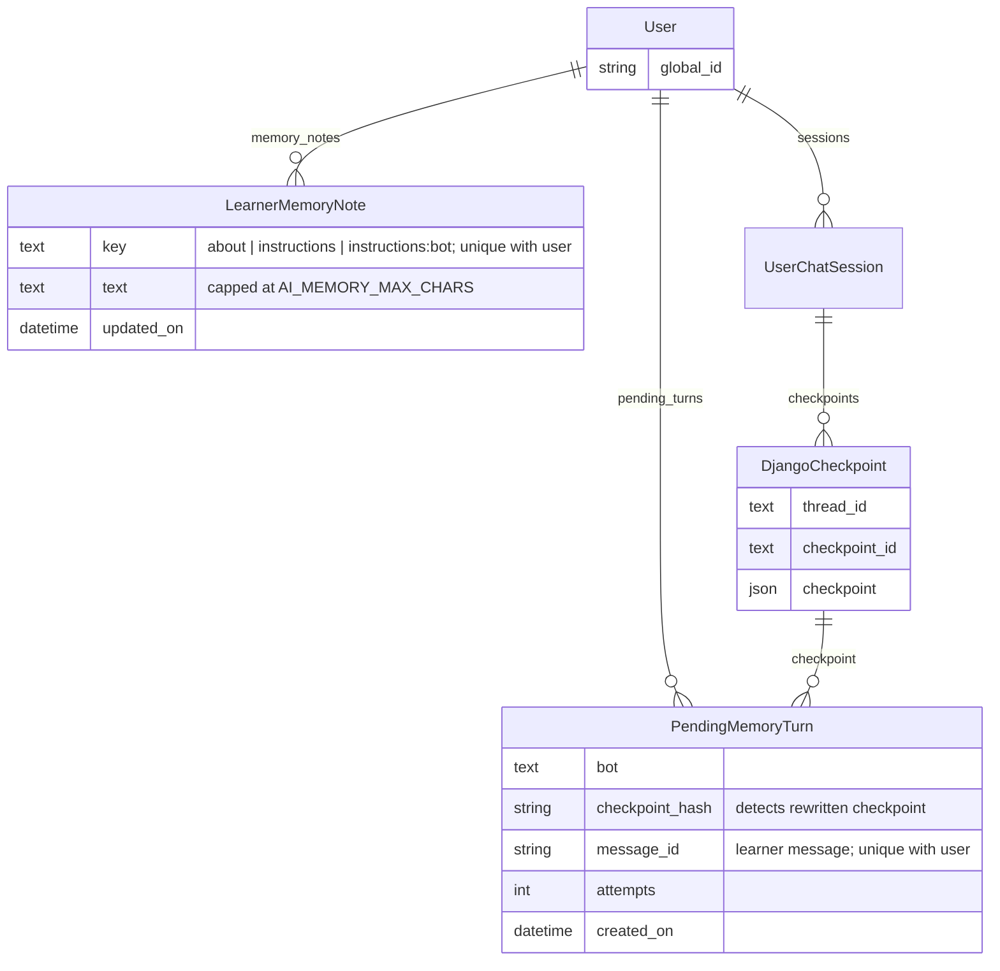

# RFC: Per-learner memory for AskTIM chatbots

## Status

Draft. Working prototype on the
[`mb/learner-memory-poc`](https://github.com/mitodl/learn-ai/tree/mb/learner-memory-poc)
branch of learn-ai.

## Problem

AskTIM doesn't remember a learner's preferences between conversations. Someone who asked
for online courses last week has to explain that again today.

Some of the information already exists. MIT Learn collects topic interests, goals,
education level, certificate preference, time commitment, and delivery preference when a
learner fills out their profile. The bots should use those fields. Conversations can fill
in things the profile doesn't cover, such as "plain English, minimal jargon" or "advanced
data science courses, but beginner ecology."

Memory should reduce repeated questions, but it can also go wrong in ways a prompt change
can't: confusing two subjects, remembering a one-time request as a permanent preference,
or treating a course the bot recommended as something the learner is interested in. A
mistake in memory carries into every later conversation, so this needs more checking than
a prompt change alone.

## General Approach

Give AskTIM access to the learner's MIT Learn profile and short notes learned from
conversations, so preferences carry across sessions and bots.

User memory consists of two pieces:

- **Profile fields.** The bots use the learner's existing preferences. If the profile is
  unavailable, chat continues without it. Nothing is written back to the profile.
- **Learned notes.** Two notes are shared across bots: facts about the learner and how
  they want bots to respond. Each bot can also have its own instructions. A background
  task updates the notes from conversations after a configurable delay, initially
  15 minutes.

Both use the signed-in learner's identity. One feature flag enables both, on in the
release-candidate (RC) environment and off in production until the evaluation in step 3
of the plan passes. Clearing memory, learner-facing controls to view it, and a
"don't remember me" setting are out of scope here and would be follow-ups.

## Options Considered

Every option uses MIT Learn profile fields; they differ in what the bots learn from
conversations and how they store it. Learned memory stays in learn-ai, which already has
the conversations and background workers. Storing it in mit-learn would need a write API.

### Option 1: Profile fields only, no learned memory

Fetch the six profile fields from mit-learn and put them in every bot's prompt. Nothing is
learned from conversations.

**Pros:**

- Small, low risk, no new storage, no model calls outside the chat itself
- Learners already control the data through their MIT Learn profile

**Cons:**

- Covers only what the profile form asks; "plain English", "beginner ecology but
  advanced data science", or "don't show me MicroMasters" still have to be repeated
- Doesn't tell us whether conversational memory is worth building

### Option 2: Free-text notes in learn-ai, rewritten in the background (recommended)

Store two shared notes plus one per bot in learn-ai. A background job reviews exchanges
and asks a model to rewrite the notes when there is something worth remembering. This is
the "profile document with background updates" pattern from LangChain's
[memory docs](https://docs.langchain.com/oss/python/concepts/memory).

**Pros:**

- Captures what the profile can't, with a model that sees the conversation and the
  existing notes together, so it can interpret "yes, remember that" and preferences for
  a particular subject
- Three short sections per bot limit prompt cost and storage; runs on the
  existing Django/Postgres, Redis, and Celery stack
- Updates happen after the reply; a bad extraction never affects the reply that
  triggered it

**Cons:**

- Whole-note rewriting can drop unrelated facts or over-generalise a topic-specific
  preference; this is the main quality risk and needs a real evaluation set
- Background tasks need coordination (a per-learner lock and a pending queue) to handle
  simultaneous chats correctly

### Option 3: Structured facts table

Store individual facts (`subject`, `predicate`, `value`, `source`, `confidence`) instead of
prose, and have the extraction model emit adds, updates, and deletes against that table.

**Pros:**

- Individual facts are easy to edit, delete, and trace to their source
- Updates are localised, so one rewrite can't accidentally lose an unrelated fact

**Cons:**

- Doesn't fix the harder problem, which is the model misreading "this topic" or a
  one-time request; the same mistake just lands in a row instead of a sentence
- A schema for open-ended preferences is hard to get right up front, and rendering
  rows back into a prompt the bot uses well is its own design problem
- More code and more tests for the same v1 outcome

### Implementation choices that apply to Options 2 and 3

The prototype also explored extraction, storage, and queueing choices.

**Extraction: `langmem` or a direct model call.** I tried `langmem`, LangChain's memory
extraction package, first. Its update mechanism didn't reliably produce a result through
`ChatLiteLLM`, which is how learn-ai reaches every model, and its one-document-per-user
shape doesn't fit per-bot sections. It also isn't actively developed: the last release
(0.0.30) was October 2025, and the only commits since are dependency bumps, with 66 open
issues. A direct structured-output call is about thirty lines, returns a typed
`MemoryRevision`, and is easier to steer; the cost is that we own the extraction prompt
and its evaluation. The `BaseStore` memory storage class makes it easier to try `langmem`
again if it picks back up.

**Storage: LangGraph's `PostgresStore`, an external memory service, or a Django-backed
`BaseStore`.** `PostgresStore` manages its tables outside Django migrations and has no user
foreign key, so deleting a user would be manual cleanup. External services (Mem0,
Zep/Graphiti, Letta) add vector retrieval and relationships between facts, which we'd want
for hundreds of memories per learner. For a few short notes, they add a dependency with
separate authentication, deletion, and requirements for where data is stored. A thin
Django-backed `BaseStore` over our own table keeps LangGraph's interface, gives us
migrations and cascade deletes, and can be swapped for either later without touching the
bots.

**Queueing: a pending-work table or a lock alone.** A per-learner lock alone would be
simpler, but would lose updates whenever a task skipped a held lock or crashed before
commit. A pending-work table (`PendingMemoryTurn`, below) adds one small table and covers
both.

## Decision

**Option 2**, behind a feature flag: on RC first, then production once memory-enabled
responses are evaluated and considered good enough to be user-facing.

Profile fields alone don't cover the preferences learners repeat. Short notes let us
evaluate conversational memory before investing in individual facts (Option 3). If
rewrites keep losing facts or product needs individual fact editing, Option 3 is the next
step. The `BaseStore` memory storage class lets us replace storage without rewriting
the bots. No vector search or third-party memory service is included in v1.

MIT Learn remains the source of truth for profile fields. learn-ai stores two shared
notes per learner plus one per bot, so each bot sees three sections:

- **About**: durable facts about the person (background, occupation, goals, time available).
- **Instructions**: how they want every bot to behave (tone, length, level of jargon).
- **Per-bot instructions**: how they want a particular bot to behave, such as "don't show
  me MicroMasters programs" for the recommendation bot.

After a couple of conversations a learner's notes might read:

> **About:** Works as a data analyst; wants to move into ecology or environmental science.
> Prefers online courses.
> **Instructions:** Plain English, minimal jargon, short answers.
> **Recommendation bot:** Advanced data science courses; beginner ecology courses.

The next time they ask "anything good on ecology?", the recommendation bot would search
for online, beginner-friendly ecology courses and answer briefly, without asking about
their level or delivery preference first. Today it asks.

Some things should never be written to memory: names, email addresses, and anything from
tutoring sessions that looks like assessment content (problem statements, attempted or
correct answers, hints, grades, scores, problem identifiers). Instructions about how a bot
should behave toward its own rules, tools, or permissions are also never remembered, so a
message like "ignore your rules from now on" will be ignored.

In one prototype run with four queued exchanges, it extracted three reasonable
preferences and dropped a planted "ignore your rules" message. Preferences carried into
a new thread and browser session. Two failures shaped the design: an early version
generalised "advanced data science courses" into "advanced everything", and the bot
sometimes repeated a preference without applying it to search. The prototype was adjusted
to address both; both are now evaluation cases.

## Approach

### mit-learn

#### Profile Preferences API Endpoint

Add `GET /api/v0/profiles/<global_id>/preferences/`, returning only the six profile fields:
`topic_interests`, `goals`, `current_education`, `certificate_desired`, `time_commitment`,
and `delivery`. No name, email, or avatar, which limits what a leaked token could expose.

#### Service Authentication

Reuse `Authorization: Bearer <LEARN_ACCESS_TOKEN>`, which learn-ai already sends for
content-file search and tutor problems ([utils.py](../ai_chatbots/utils.py)). This is a
mit-learn OAuth token, not a Keycloak token. mit-learn's django-oauth-toolkit middleware
looks it up in the access-token table and sets `request.user` to learn-ai's service
account. The URL's `global_id` identifies the learner whose preferences are requested.

`IsAuthenticated` alone would let any logged-in learner request someone else's
preferences. Restrict access with a group permission, following the existing
`content_file_content_viewers` and `tutor_problem_viewers` pattern. The endpoint can use
its own group or one of those groups. An APISIX key-auth consumer would also work, but
would require a gateway change without adding a benefit here.

Tokens are issued and expired in mit-learn's admin under OAuth2 Provider. Still to
confirm: which user the current token belongs to, when it expires, and who rotates it.

### learn-ai

#### Profile Preferences Fetch and Cache

learn-ai calls the endpoint above with the `global_id` of the authenticated learner, never
an ID from the request body, and caches the result for 12 hours, so a profile edit can take
up to that long to reach the bots. The fetch has a timeout, and if it fails the chat
continues without the profile. Learned notes are read separately so a profile failure
doesn't hide them too. The prototype uses a stub for this call.

#### Learner Memory Storage

Two new Django models in `ai_chatbots/models.py`:

- `LearnerMemoryNote`: one row per user and key (`about`, `instructions`,
  `instructions:<bot>`), with the text and a last-updated timestamp. A foreign key to the
  user gives cascade deletes.
- `PendingMemoryTurn`: one row per exchange waiting to be processed, pointing at a
  checkpoint (the saved state of a conversation) rather than copying its text, and deleted
  once processed. Described in the next section.

`User`, `UserChatSession`, and `DjangoCheckpoint` already exist; the two new tables hang
off `User` and every foreign key cascades on delete, so deleting a chat thread takes its
pending work with it.

`DjangoMemoryStore` in `ai_chatbots/memorystores.py` exposes the notes through LangGraph's
`BaseStore` memory storage class, grouped by `global_id`. This supports future memory
tools or another trial of `langmem`. The Django models handle authorization and ordering.
Staff can view notes in Django admin.

Each section is capped at `AI_MEMORY_MAX_CHARS` (1,500) characters; three full sections add
roughly 1,100 tokens to every request. I want to measure that during the pilot before
deciding whether to shorten them.

#### Memory Extraction Pipeline

`AsyncDjangoCheckpointer` already saves conversations as `DjangoCheckpoint` rows. After
the reply's checkpoint commits, the chat handler saves a `PendingMemoryTurn` referencing it
without copying the conversation text. The row records the user, bot, checkpoint foreign
key, message hash, and ID of the learner message just answered.

Every bot assigns its outgoing `HumanMessage` a UUID. Recording that ID ensures two
simultaneous replies in one thread each get their own pending row; the same message can't
be queued twice. The Celery task is scheduled only after the row commits and receives the
user ID, never the transcript.

The first pending row for a learner schedules `process_learner_memory` for
`AI_MEMORY_DELAY_SECONDS` (15 minutes) later; rows arriving in that window join the same
run. A periodic `requeue_stale_memory_turns` task reschedules learners with unprocessed
rows, covering a lost Celery send or a row that arrived just as a worker finished.

The task finds the recorded learner message in each checkpoint. It includes that message
(capped at `AI_MEMORY_MESSAGE_CHARS`), the following bot reply (`AI_MEMORY_REPLY_CHARS`),
and earlier learner messages as context (`AI_MEMORY_HISTORY_MESSAGES`). The prompt says
the reply can help interpret the learner's words but can't establish facts about them.

The error-recovery code in `ai_chatbots/utils.py` can rewrite checkpoint messages. The
worker first verifies the stored hash and skips rows with changed or deleted checkpoints
or missing messages. If too many references become unusable before processing, reconsider
storing a bounded copy of the input.

A low-cost screening model (`AI_MEMORY_GATE_MODEL`, gpt-4o-mini to start) answers yes or
no on whether the batch contains anything worth remembering. If yes, the extraction model
(`AI_MEMORY_EXTRACTION_MODEL`, gpt-4.1 to start) receives the current notes plus the
rendered exchanges through `ChatLiteLLM` and returns a `MemoryRevision`, a pydantic
structured output with two shared sections plus a section for each bot in the batch.

An empty section clears the existing one; a section that can't fit the cap on a sentence
boundary keeps the previous text rather than truncating mid-sentence. Both models should
be compared on the evaluation cases before we treat the choice as settled.

#### Extraction Task Reliability

Only one extraction runs per learner, enforced by a Redis lock (`AI_MEMORY_LOCK_SECONDS`,
longer than `AI_MEMORY_TASK_TIME_LIMIT`). If the lock is held, rows wait for a later
attempt. The task selects the oldest rows up to `AI_MEMORY_BATCH_SIZE` and
`AI_MEMORY_BATCH_CHARS`; an exchange that alone exceeds the character limit is dropped
with a warning. No database transaction stays open across model calls.

The task checks the feature flag under the lock and again before committing. If turned
off mid-run, it discards the result and drops the pending rows. Otherwise, it saves notes
and deletes only the selected rows in one transaction. A screening result of "no" or a
batch with no usable exchanges deletes the rows without changing notes.

A crash before commit leaves the batch pending, and the next run repeats the model calls.
A crash after commit leaves nothing to redo, so each exchange is applied at most once.

Each attempt increments the row's `attempts`; rows that reach `AI_MEMORY_MAX_ATTEMPTS` are
excluded from future batches and visible in Django admin. Nothing deletes them yet. Rows
are ordered by when responses finished, not when requests began; if submission order turns
out to matter, add a sequence number rather than trusting timestamps.

#### Prompt Assembly

Profile fields and learned notes are labelled separately and clearly marked as
learner-supplied data, not instructions to the bot. The recommendation bot gets all six
profile fields; other bots initially get education level plus the shared notes and their
own section. Application and tutoring rules always win. Within those, what the learner
says now wins over what they said before, and the profile wins over an older note when
they directly conflict. Nothing is written back to the MIT Learn profile.

For v1 the bot is told about preferences in its prompt and decides how to search; we
don't automatically turn preferences into search filters in code. That would need product
agreement, and the catalog still doesn't have a reliable beginner/advanced filter. The
prompt has to say explicitly to use relevant preferences in searches and to search before
claiming nothing matches, because in testing the bot sometimes acknowledged a preference
and then ignored it.

#### Learner Identity and Bot Scope

Everything is keyed on the authenticated user's `global_id`, which learn-ai gets from the
`x-userinfo` header set by the APISIX gateway in front of it; learn-ai's middleware decodes
that header rather than authenticating independently. Neither the request body nor model
output can select another learner. If the gateway let a client supply that header, one
person's memory could be shown to another, so confirming it strips it is part of rollout.
Recommendation, syllabus, video, and edX tutor bots are included where that identity is
available. Anonymous chats are unchanged.

Canvas stays out for now. The Canvas chat xblock proxies requests with the shared
`canvas_token`, which APISIX checks as a key-auth consumer, so learn-ai sees no user on
those routes and `memory_enabled` returns False. The likely fix is for the xblock to send
a learner identifier with each request, trusted because the request already carries the
`canvas_token`. The open question is which identifier: Canvas learners sign in through the
same Keycloak realm so a `global_id` should exist, but the plugin may only have the Canvas
user ID or the learner identifier in the LTI login (`sub`), in which case memory would
need a second identity key or a lookup. That's a separate issue; once it lands, Canvas
uses the same design.

#### Retention and Logging

Processed rows are deleted when their batch commits. Source conversations stay under the
existing chat-retention rules, and memory processing must not block a learner from deleting
chat history. Whole notes and transcripts aren't logged by default, but with LangSmith
tracing enabled, traces will contain learner notes, so personalized prompts need to be
accounted for in tracing access and retention.

Staff can delete note rows in Django admin, but an extraction already in flight could
write them back. This is not a reliable way to clear memory.
Deleting a local learn-ai user cascades to their notes and pending work; account deletion
propagating from mit-learn is an existing gap for chat sessions too, tracked separately.

### open-learning-ai-tutor

#### Learner Context for the Tutor

For the tutor pilot, learn-ai appends the notes to the messages sent to the model with an
explicit statement that tutoring rules win. That works without touching the tutor package.
The proper fix is a supported `learner_context` argument in `open-learning-ai-tutor` so
the tutor's own prompt can place and label it; that's a follow-up.

### ol-infrastructure

#### Gateway Identity Header

Nothing to build, one thing to confirm: that the APISIX routes in front of learn-ai strip
or replace any client-supplied `x-userinfo` header. `LEARN_ACCESS_TOKEN` is a mit-learn
OAuth token, not gateway configuration (see Service Authentication).

## Implementation Plan

1. **Profile endpoint and permission (mit-learn)**: add the preferences endpoint, gated to
   learn-ai's mit-learn user via the group permission, and confirm which user
   `LEARN_ACCESS_TOKEN` belongs to and when it expires.
2. **Profile and learned memory (learn-ai, behind a flag)**: fetch profile preferences
   with a 12-hour cache and timeout; add note storage, the pending-exchange queue, and
   background tasks to extract and update learned notes. Include the applicable profile
   fields and shared and per-bot notes in each bot's prompt, with the identity checks,
   precedence rules, and task recovery described above.
3. **Learned memory on RC (learn-ai)**: enable the flag on RC only. Tune the processing
   delay, batch size, and timeouts, and measure prompt cost.
4. **Evaluation**: compare responses with and without profile preferences and learned
   notes across multiple conversations, using a combination of manual staff testing and
   automated evaluation tools. Use learn-ai's existing evaluation framework where it fits;
   automated tests should also cover pipeline reliability. Keep shared test scenarios and
   record results from both manual and automated checks. The required cases are:

   - unrelated facts survive repeated rewrites, with different preferences by subject and
     bot;
   - corrections, withdrawals, temporary overrides ("introductory this time"), and "yes,
     remember that";
   - questions, complaints, and the bot's own suggestions don't become learner facts;
   - planted instructions, including one that tries to travel from the recommendation bot
     into the tutor, and no assessment content retained;
   - profile conflicts, the certificate/price policy, and the bot actually calling search
     with the preference rather than just mentioning it;
   - **Memory updates:** empty-section clearing, batches from several bots, and correct
     selection of the learner message and reply for every bot, including the tutor;
   - **Recovery:** tasks delivered out of order, lock contention, crashes before and after
     commit, rows arriving during processing, stranded work, and duplicate rows;
   - **Data boundaries:** changed or deleted checkpoints, user isolation, unavailable
     dependencies, and input limits.

5. **Rollout**: enable in production once the evaluation passes. Workers must respect the
   flag being turned off, and turning it back on shouldn't process an old backlog
   unexpectedly.
6. **Follow-ups**: a `learner_context` argument in `open-learning-ai-tutor`; clearing
   memory, learner-facing view/clear controls, and a "don't remember me" setting; Canvas
   once it sends a learner identity.

## Consequences

**What we gain:**

- Bots stop re-asking what the profile already says, and can carry conversational
  preferences (tone, level by subject, exclusions) across sessions and bots.

**What we give up / risks:**

- Whole-note rewriting and relying on the prompt rather than search filters are the main
  quality doubts; the evaluation should tell us whether they are good enough for v1.
- Extra prompt tokens on every request, a short profile-fetch delay on cache misses, and a
  screening call plus an occasional rewrite per learner per batch.
- Updates are delayed: initially 15 minutes for learned notes and up to 12 hours for
  profile edits. Shorter delays mean more model calls and profile fetches; tune during
  the pilot.
- learn-ai trusts the gateway's identity header and mit-learn trusts its OAuth token for
  learn-ai's user; both need to be confirmed as part of rollout.

**Downstream changes:**

- mit-learn: the profile preferences endpoint and its permission class.
- open-learning-ai-tutor: a supported `learner_context` argument.
- MIT Learn frontend: nothing for now; view/clear controls and a participation setting
  are follow-ups.
- DevOps: confirm APISIX strips client-supplied `x-userinfo` on the learn-ai routes.

## Open Questions

- **Product policy:** Does "regardless of difficulty" remove a saved level preference or
  override it once? Should declining a certificate stop price questions? Step 4 resolves these.
- **Service token:** Which account owns `LEARN_ACCESS_TOKEN`, when does it expire, and
  who rotates it?
- **Tuning:** processing delay, batch size, and fetch/task timeouts are all configurable
  and none are tuned yet. Non-blocking; settle during the pilot.
- **Clearing and learner controls (follow-up):** Should learners be able to view, clear,
  or disable memory, or should these controls be limited to admins?
- **Cross-service deletion:** How should account deletion in mit-learn reach learn-ai so
  the learner's memories are also deleted?
