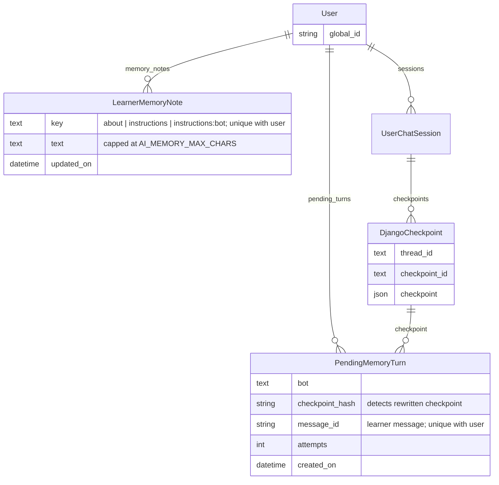

# RFC: Per-learner memory for AskTIM chatbots

## Status

Draft. Working prototype on the
[`mb/learner-memory-poc`](https://github.com/mitodl/learn-ai/tree/mb/learner-memory-poc)
branch of learn-ai.

## Problem

AskTIM doesn't remember a learner's preferences between conversations. Someone who asked
for online courses last week has to explain that again today.

Some of the information already exists. MIT Learn collects topic interests, goals,
education level, certificate preference, time commitment, and delivery preference when a
learner fills out their profile. The bots should use those fields. Conversations can fill
in things the profile doesn't cover, such as "plain English, minimal jargon" or "advanced
data science courses, but beginner ecology."

Memory should reduce repeated questions, but it can also go wrong in ways a prompt change
can't: confusing two subjects, remembering a one-time request as a permanent preference,
or treating a course the bot recommended as something the learner is interested in. A
mistake in memory carries into every later conversation, so this needs more checking than
a prompt change alone.

## General Approach

Give AskTIM bots the learner's MIT Learn profile fields, and add short free-text notes
learned from conversations that a background task keeps up to date. The benefit is fewer
repeated questions and preferences that carry across sessions and bots.

User memory consists of two pieces:

- **Profile fields.** mit-learn gets a small endpoint that returns the six profile
  preference fields (topic interests, goals, education level, certificate preference, time
  commitment, delivery) for one learner, restricted to the learn-ai service identity.
  learn-ai fetches it for the authenticated learner, caches it for 12 hours, and puts the
  fields in the bot's prompt. If the fetch fails the chat continues without them. The
  profile stays the source of truth; nothing is written back.
- **Learned notes.** Short notes per learner: about them, how they want every bot to
  behave, and a per-bot section for how they want that bot to behave. Stored in three
  small Django tables in learn-ai. After each reply the consumer records a pointer to that
  exchange; 15 minutes later (configurable) a Celery task reads the pending exchanges, asks
  a cheap model whether there's anything worth remembering, and if so asks a larger model
  to rewrite the notes. Each note is capped at 1,500 characters and updates are guarded
  against race conditions. Staff can see notes in Django admin.

Both are keyed on the authenticated user's `global_id` from the gateway; nothing in the
request body or model output can select another learner. Both sit behind feature flags,
on in RC and off in production to start. We try it out on RC, and enable it in production
once it works well and the evaluation in step 3 of the plan passes. Clearing memory,
learner-facing controls to view it, and a "don't remember me" setting are out of scope here
and would be follow-ups.

## Options Considered

The main question is what shape learned memory takes and who maintains it. Using the
MIT Learn profile fields is common to every option; they differ in what, if anything, the
bots learn from conversations. All of them keep learned memory in learn-ai: it already has
the conversations and the background workers, and mit-learn would need a write API.

### Option 1: Profile fields only, no learned memory

Fetch the six profile fields from mit-learn and put them in every bot's prompt. Nothing is
learned from conversations.

**Pros:**

- Small, low risk, no new storage, no model calls outside the chat itself
- Learners already control the data through their MIT Learn profile

**Cons:**

- Covers only what the profile form asks; "plain English", "beginner ecology but
  advanced data science", or "don't show me MicroMasters" still have to be repeated
- Doesn't tell us whether conversational memory is worth building

### Option 2: Free-text notes in learn-ai, rewritten in the background (recommended)

Three short free-text notes per learner (about the person, instructions for every bot,
instructions per bot), stored in learn-ai behind LangGraph's `BaseStore` interface. After
each reply, a background job decides whether the exchange contained anything worth
remembering and, if so, has a model rewrite the notes with the conversation in front of it.
This is the "profile document with background updates" pattern from LangChain's
[memory docs](https://docs.langchain.com/oss/python/concepts/memory).

**Pros:**

- Captures what the profile can't, with a model that sees the conversation and the
  existing notes together, so "yes, remember that" and topic-scoped preferences have a
  chance of being understood
- Three fixed sections keep the prompt cost bounded and the storage trivial; runs on the
  existing Django/Postgres, Redis, and Celery stack
- Nothing happens while the learner waits; a bad extraction never affects the reply that
  triggered it

**Cons:**

- Whole-note rewriting can drop unrelated facts or over-generalise a topic-specific
  preference; this is the main quality risk and needs a real evaluation set
- No way to clear memory in v1, and no learner-facing view or edit
- Background processing needs ordinary but real plumbing (a per-learner lock and a
  pending queue) so that concurrent chats behave correctly

### Option 3: Structured facts table

Store individual facts (`subject`, `predicate`, `value`, `source`, `confidence`) instead of
prose, and have the extraction model emit adds, updates, and deletes against that table.

**Pros:**

- Per-fact editing, provenance, and targeted deletion come naturally
- Updates are localised, so one rewrite can't accidentally lose an unrelated fact

**Cons:**

- Doesn't fix the harder problem, which is the model misreading "this topic" or a
  one-time request; the same mistake just lands in a row instead of a sentence
- A schema for open-ended preferences is hard to get right up front, and rendering
  rows back into a prompt the bot uses well is its own design problem
- More code and more tests for the same v1 outcome

### Implementation choices that apply to Options 2 and 3

Whichever shape we pick, two narrower questions follow: what does the extraction, and
where do the notes live. Both were tried in a prototype.

**Extraction: `langmem` or a direct model call.** `langmem` is LangChain's memory
extraction package, and I tried it first. Its trustcall patch loop didn't converge reliably
through `ChatLiteLLM`, which is how learn-ai reaches every model, and its
one-document-per-user shape doesn't fit per-bot sections. A direct structured-output call
is about thirty lines, returns a typed `MemoryRevision`, and is easier to steer with the
prompt. The cost is that we own the extraction prompt and its evaluation. Retrying
`langmem` on a later version would need a re-test through `ChatLiteLLM` and a comparison on
the same evaluation cases; the `BaseStore` seam is what makes that retry cheap.

**Storage: LangGraph's `PostgresStore`, an external memory service, or a Django-backed
`BaseStore`.** `PostgresStore` is the obvious default, but it manages its tables outside
Django migrations and has no user foreign key, so deleting a user would be manual cleanup
instead of a cascade delete. External services (Mem0, Zep/Graphiti, Letta) add vector
retrieval and relationships between facts, which we'd want if a learner had hundreds of
memories, but they are a new dependency with their own auth, deletion, and data-residency
story, for what is currently three short notes per learner. A thin Django-backed
`BaseStore` over our own table keeps LangGraph's interface, gives us migrations and cascade
deletes for free, and can be swapped for either of the others later without touching the
bots. None of the three covers queueing; that plumbing is ours either way.

**Queueing: a pending-work table or a lock alone.** A per-learner lock without a
pending-work table (`PendingMemoryTurn`, described under Learner Memory Storage below)
would be simpler, but would lose updates whenever a task skipped a held lock or crashed
before commit. The pending table costs one small
model and handles both without assuming a repeated model call is harmless. A larger event
ledger or revision scheme can wait unless we add independent writers.

## Decision

**Option 2**, first behind a feature flag, enabled on RC only at first, then on production once memory-enabled AI responses are evaluated and considered good enough to be user-facing.

What settles it: the profile fields alone don't cover the things learners actually repeat,
and a small free-text design lets us find out whether conversational memory is any good
before investing in per-fact editing (Option 3). If rewrites keep losing unrelated facts,
or product needs per-fact editing, Option 3 is the next step and the `BaseStore` seam
means it's a storage change, not a rewrite.

The MIT Learn profile will remain the source of truth for the six profile fields, and
learn-ai fetches and caches a copy. What the bots learn is stored in learn-ai as two
shared notes per learner plus one per bot, so each bot sees three sections:

- **About**: durable facts about the person (background, occupation, goals, time available).
- **Instructions**: how they want every bot to behave (tone, length, level of jargon).
- **Per-bot instructions**: how they want a particular bot to behave, such as "don't show
  me MicroMasters programs" for the recommendation bot.

After a couple of conversations a learner's notes might read:

> **About:** Works as a data analyst; wants to move into ecology or environmental science.
> Prefers online courses.
> **Instructions:** Plain English, minimal jargon, short answers.
> **Recommendation bot:** Advanced data science courses; beginner-level in general otherwise.

The next time they open the recommendation bot and ask "anything good on remote sensing?",
the bot would search for online, beginner-friendly courses and answer
briefly, prioritizing any results that are ecology-related, without asking about their level or
delivery preference first. Today it asks.

On the implementation choices above: the store is a thin `DjangoMemoryStore` over a
`LearnerMemoryNote` table behind LangGraph's `BaseStore`, extraction is one
structured-output call through `ChatLiteLLM`, and pending exchanges go in a table. No
vector search and no third-party memory service for now.

Some things should never be written to memory: names, email addresses, and anything from
tutoring sessions that looks like assessment content (problem statements, attempted or
correct answers, hints, grades, scores, problem identifiers). Instructions about how a bot
should behave toward its own rules, tools, or permissions are also never remembered, so a
message like "ignore your rules from now on" will be ignored.

What I've observed so far from a prototype: In one test run with
four queued exchanges, it extracted three reasonable preferences and dropped a planted
"ignore your rules" message. Preferences stated in one thread showed up in a new thread and
a new browser session. It also surfaced two real quality problems that shaped the design:
an early version generalised a preference for "advanced data science courses" into
"advanced everything", and the bot sometimes read a preference back without actually applying
it to the search. The prototype was adjusted to try preventing this and both are now evaluation
cases.

## Approach

### mit-learn

#### Profile Preferences API Endpoint

Add `GET /api/v0/profiles/<global_id>/preferences/`, returning only the six profile fields:
`topic_interests`, `goals`, `current_education`, `certificate_desired`, `time_commitment`,
and `delivery`. No name, email, or avatar, which limits what a leaked token could expose.

#### Service Authentication

The preferences fetch is a server-to-server call with no browser involved. learn-ai
already makes calls like this for content-file search, learning-resource search, and tutor
problems, sending `Authorization: Bearer <LEARN_ACCESS_TOKEN>`
([utils.py](../ai_chatbots/utils.py)), and the preferences fetch reuses that. The token is not a Keycloak token: it is a 64-character opaque string (I
checked its shape in the sops files, not its value), and mit-learn runs django-oauth-toolkit
with `OAuth2TokenMiddleware` and `OAuth2Backend`, which look a bearer token up in
mit-learn's own access-token table and set `request.user` to the user that token belongs
to. So learn-ai is, in effect, a mit-learn user account, and `LEARN_ACCESS_TOKEN` is an
OAuth access token issued to that account in mit-learn's Django admin. The learner whose
preferences are wanted is named by the `global_id` in the URL, not by the token.

Because the token is turned into a `request.user` before the view runs, Django can't check
"the caller presented `LEARN_ACCESS_TOKEN`"; it can only check who `request.user` is. Plain
`IsAuthenticated` would therefore let any logged-in learner read other learners'
preferences by guessing a `global_id`. Two mit-learn endpoints learn-ai already calls
handle this the obvious way: the vector content-file search behind the syllabus and video
bots requires staff or the `content_file_content_viewers` group
(`IsAdminOrContentFileContentViewer`), and the tutor problems endpoint requires staff or
`tutor_problem_viewers` (`IsAdminOrTutorProblemViewer`). learn-ai's account must already
satisfy both for those bots to work, though I can't see the production database to say
whether it's staff or in the groups. The preferences endpoint reuses the pattern with a
group of its own or one of those. An APISIX key-auth
consumer for learn-ai (the way learn-ai authenticates the Canvas plugin with
`canvas_token`) would also work, but needs a gateway change for no gain here, so the
permission class it is.

That also mostly answers how the token is issued and rotated: OAuth access tokens are
created and expired in mit-learn's admin under OAuth2 Provider, and each has an `expires`
date. What's left to confirm is which mit-learn user the token belongs to, whether that
user is in the group, when the current token expires, and who owns rotating it.

### learn-ai

#### Profile Preferences Fetch and Cache

learn-ai calls the endpoint above with the `global_id` of the authenticated learner, never
an ID from the request body, and caches the result for 12 hours, so a profile edit can take
up to that long to reach the bots. The fetch has a timeout, and if it fails the chat
continues without the profile. Learned notes are read separately so a profile failure
doesn't hide them too. The prototype uses a stub for this call.

#### Learner Memory Storage

Two new Django models in `ai_chatbots/models.py`:

- `LearnerMemoryNote`: one row per user and key (`about`, `instructions`,
  `instructions:<bot>`), with the text and a last-updated timestamp. A foreign key to the
  user gives cascade deletes.
- `PendingMemoryTurn`: one row per exchange waiting to be processed, pointing at the
  checkpoint rather than copying its text, and deleted once processed. Described in the
  next section.

`User`, `UserChatSession`, and `DjangoCheckpoint` already exist; the two new tables hang
off `User` and every foreign key cascades on delete. `PendingMemoryTurn` points at the
checkpoint holding the exchange rather than copying its text, so clearing chat history
takes the pending work with it.

`DjangoMemoryStore` in `ai_chatbots/memorystores.py` exposes the notes through LangGraph's
`BaseStore` interface, namespaced by the learner's `global_id`. It's a thin adapter over
the same table, so an agent-side memory tool or a later retry of `langmem` can plug in
without a rewrite. Authorization and ordering are handled by the Django models around it,
not by the store.

Each section is capped at `AI_MEMORY_MAX_CHARS` (1,500) characters. Three full sections add
roughly a page of text, on the order of 1,100 tokens, to every request. I want to measure
that cost during the pilot before deciding whether to shorten them.

#### Memory Extraction Pipeline

The `AsyncDjangoCheckpointer` already saves every conversation as `DjangoCheckpoint` rows
(a checkpoint is the saved state of a thread after each reply). Rather than copy
conversation text into another table, the consumer saves a `PendingMemoryTurn` after the
reply's checkpoint is committed: the user, bot, a foreign key to that checkpoint, a hash of its messages, and the ID of the learner message the run just
answered (every bot tags its outgoing `HumanMessage` with a UUID). Each row means "this
exchange (that learner message plus the bot reply that follows it) is waiting to be looked
at." Pinning the message rather than "the checkpoint's last message" means two replies
racing in the same thread each get their own row instead of both resolving to whichever
finished last. The row uses the user and thread the consumer already validated for the
chat itself, the Celery task is scheduled only after the row commits, and the task
receives the user ID, never the transcript. The same message can't be queued twice.

The first pending row for a learner schedules the `process_learner_memory` Celery task
`AI_MEMORY_DELAY_SECONDS` (15 minutes) later; rows arriving during that window join the
same run and don't restart the timer. A periodic `requeue_stale_memory_turns` task finds
learners with unprocessed rows and reschedules them, which covers a lost Celery send or a
row that arrived just as a worker finished.

The task reads each referenced checkpoint, not whichever checkpoint is latest, and finds
the pinned learner message inside it. That message is the exchange, capped at
`AI_MEMORY_MESSAGE_CHARS` (2000); the bot message that follows it is the reply, capped at
`AI_MEMORY_REPLY_CHARS` (500); earlier learner messages are context, bounded by
`AI_MEMORY_HISTORY_MESSAGES` and the same per-message cap. Each message is labelled by
speaker, and the prompt says the reply can help interpret the learner's words but can't
establish facts about them. A
checkpoint isn't immutable: the error-recovery code in `ai_chatbots/utils.py` can rewrite
its message list. So the worker verifies the stored hash before use, and if the checkpoint
changed, was deleted, or no longer identifies the expected exchange, the row is skipped and
counted rather than replaced with newer history. A transient database error is retried,
not treated as deletion. If testing shows references are too often unusable by the time
the task runs, we should reconsider storing a bounded copy of the input.

A cheap gate model (`AI_MEMORY_GATE_MODEL`, gpt-4o-mini to start) answers yes or no on
whether the batch contains anything worth remembering. If yes, the extraction model
(`AI_MEMORY_EXTRACTION_MODEL`, gpt-4.1 to start) receives the current notes plus the
rendered exchanges and returns a `MemoryRevision`, a pydantic structured output with the
three sections. A batch spanning several bots keeps their labels and returns separate
per-bot sections. Validation before saving: an empty section clears the existing one, and
a section that doesn't fit the cap on a clean sentence boundary keeps the previous text
rather than truncating mid-sentence. Both models are configurable and should be compared
on the evaluation cases before we treat the choice as settled.

#### Extraction Task Reliability

The task acquires a per-learner Redis lock (`AI_MEMORY_LOCK_SECONDS`, longer than
`AI_MEMORY_TASK_TIME_LIMIT`) so only one extraction runs per learner. If the lock is held,
the rows are left for a later attempt. It reads the oldest pending rows up to
`AI_MEMORY_BATCH_SIZE` and `AI_MEMORY_BATCH_CHARS`, ordered by creation time then ID, and
no database transaction is held open across the model calls. `AI_MEMORY_BATCH_CHARS`
bounds the exchange text selected for a batch (the prompt, section labels, and current
notes are on top of that): an exchange that exceeds it on its own is treated as unusable
and dropped with a warning rather than admitted as the first item in a batch. The
feature-flag check also runs under the lock, so turning the flag off can't race an
extraction that is already in flight.

After the models return, the task re-reads the feature flag; if it was turned off mid-run
the result is discarded and the pending rows dropped. Otherwise it saves the notes and
deletes only the selected rows in one transaction. A gate "no" or an all-unusable batch deletes the selected rows without touching the notes. A
crash before commit leaves the whole batch pending, so the next run repeats both model
calls and may write a different revision; a crash after commit leaves nothing to redo.
Either way each exchange is applied to the notes at most once.

Each attempt increments the row's `attempts`; rows that reach `AI_MEMORY_MAX_ATTEMPTS`
are excluded from future batches and visible in Django admin. Nothing deletes them yet;
that retention policy is an open question. Rows are ordered by when responses finished, not
when requests began, which is worth testing with overlapping requests. If submission order
turns out to matter, add a sequence number rather than trusting timestamps.

#### Prompt Assembly

Profile fields and learned notes are labelled separately and clearly marked as
learner-supplied data, not instructions to the bot. The recommendation bot gets all six
profile fields; other bots initially get education level plus the shared notes and their
own section. Application and tutoring rules always win. Within those, what the learner
says now wins over what they said before, and the profile wins over an older note when
they directly conflict. Nothing is written back to the MIT Learn profile.

For v1 the bot is told about preferences in its prompt and decides how to search; we
don't automatically turn preferences into search filters in code. That would need product
agreement, and the catalog still doesn't have a reliable beginner/advanced filter. The
prompt has to say explicitly to use relevant preferences in searches and to search before
claiming nothing matches, because in testing the bot sometimes acknowledged a preference
and then ignored it.

#### Learner Identity and Bot Scope

Everything is keyed on the authenticated user's `global_id`. Request fields, cookies, and
model output can't select someone else's profile or memory. This relies on the APISIX
gateway in front of learn-ai to tell it who the logged-in user is via `x-userinfo`;
learn-ai's middleware decodes that header rather than authenticating it independently. If
that gateway setting were wrong, one person's memory could be shown to another, so
confirming it is part of rollout. Recommendation, syllabus, video, and edX tutor bots are
included where that identity is available. Anonymous chats are unchanged.

Canvas stays out for now. The Canvas chat xblock proxies requests to learn-ai with the
shared `canvas_token`, which APISIX checks as a key-auth consumer, so learn-ai sees no user
on those routes and `memory_enabled` returns False for lack of a `global_id`. The Canvas
consumers inherit the memory hooks but never read or write notes. The likely fix is for the
xblock to send a learner identifier with each request, trusted only because the request
already carries the `canvas_token`; that turns the shared token into a delegation
credential, so it should stay restricted to the plugin's own APISIX consumer. The open
question is which identifier: Canvas learners sign in through the same Keycloak realm, so a
`global_id` should exist for them, but the plugin may only have the Canvas user ID or the
LTI `sub`. If it can't map to the Keycloak `sub`, memory would need a second identity key
or a lookup. That's a separate issue; once it lands, Canvas uses the same design.

#### Retention and Logging

Processed rows are deleted when their batch commits. Source conversations stay under the
existing chat-retention rules, and memory processing must not block a learner from
deleting chat history. Whole notes and transcripts aren't logged by default, and
personalized prompts need to be accounted for in tracing access and retention: with
LangSmith tracing enabled, traces will contain learner notes.

There is no clear operation in this RFC. Staff can delete note rows in Django admin, but
an extraction already in flight could write them back, so a proper clear (and learner-facing
controls for it) is a follow-up. Deleting a local learn-ai user cascades to their notes and
pending work. Account deletion propagating from mit-learn is an existing gap for chat
sessions too; that's tracked separately and this doesn't fix it.

### open-learning-ai-tutor

#### Learner Context for the Tutor

For the tutor pilot, learn-ai appends the notes to the messages sent to the model with an
explicit statement that tutoring rules win. That works without touching the tutor package.
The proper fix is a supported `learner_context` argument in `open-learning-ai-tutor` so
the tutor's own prompt can place and label it; that's a follow-up.

### ol-infrastructure

#### Gateway Identity Header

Nothing to build, one thing to confirm: that the APISIX routes in front of learn-ai strip
or replace any client-supplied `x-userinfo` header. `LEARN_ACCESS_TOKEN` is a mit-learn
OAuth token, not gateway configuration (see Service Authentication).

## Implementation Plan

1. **Profile endpoint and permission (mit-learn)**: add the preferences endpoint, gated to
   learn-ai's mit-learn user via the group permission, and confirm which user
   `LEARN_ACCESS_TOKEN` belongs to and when it expires.
2. **Profile in prompts (learn-ai, behind a flag)**: fetch user preferences from mit-learn,
   12-hour cache, and timeout; label the fields in each bot's prompt.
3. **Evaluation set**: extend the existing evaluation framework with checked-in
   multi-session conversations and compare outputs with and without user memories. The
   behaviour cases I think are required:
   - unrelated facts survive repeated rewrites, with different preferences by subject and
     bot;
   - corrections, withdrawals, temporary overrides ("introductory this time"), and "yes,
     remember that";
   - questions, complaints, and the bot's own suggestions don't become learner facts;
   - planted instructions, including one that tries to travel from the recommendation bot
     into the tutor, and no assessment content retained;
   - profile conflicts, the certificate/price policy, and the bot actually calling search
     with the preference rather than just mentioning it;
   - and for the pipeline itself: empty-section clearing, batches from several bots, tasks
     delivered out of order, lock contention, crashes before and after commit, rows
     arriving during processing, recovery of stranded work, changed or deleted
     checkpoints, duplicate rows, correct selection of the learner message and reply for
     each bot (including the tutor), user isolation, unavailable dependencies, and input
     limits.
4. **Product policy**: get answers to the two questions the model shouldn't decide for us:
   whether "regardless of difficulty" removes a saved level preference or only overrides it
   once, and whether declining a certificate should stop the bot asking about price
   (declining a certificate doesn't tell us someone's budget).
5. **Learned memory on RC (learn-ai)**: enable the extraction flag on RC only. Tune the
   processing delay, batch size, and timeouts, and measure prompt cost.
6. **Rollout**: enable bot by bot behind flags once the evaluation passes. Workers must
   respect the flag being turned off, and turning it back on shouldn't process an old
   backlog unexpectedly.
7. **Follow-ups**: a `learner_context` argument in `open-learning-ai-tutor`; clearing
   memory, learner-facing view/clear controls, and a "don't remember me" setting; Canvas
   once it sends a learner identity.

## Consequences

**What we gain:**

- Bots stop re-asking what the profile already says, and can carry conversational
  preferences (tone, topic-scoped level, exclusions) across sessions and bots.
  .

**What we give up / risks:**

- Whole-note rewriting and prompt-only search are the main quality doubts; the evaluation
  should tell us whether they are good enough for v1.
- Extra prompt tokens on every request, a short profile-fetch delay on cache misses, and a
  gate call plus an occasional rewrite per learner per batch.
- Neither kind of memory is instant. Learned notes update after a configurable delay
  (`AI_MEMORY_DELAY_SECONDS`, 5 minutes to start) and profile edits appear when the cache
  expires (12 hours to start). Shorter values mean more extraction calls and more profile
  fetches; both are worth tuning during the pilot rather than fixing now.
- learn-ai trusts the gateway's identity header and mit-learn trusts its OAuth token for
  learn-ai's user; both need to be confirmed as part of rollout.

**Downstream changes:**

- mit-learn: the profile preferences endpoint and its permission class.
- open-learning-ai-tutor: a supported `learner_context` argument.
- MIT Learn frontend: nothing for now; view/clear controls and a participation setting
  are follow-ups.
- DevOps: confirm APISIX strips client-supplied `x-userinfo` on the learn-ai routes.

## Open Questions

- **Tuning:** processing delay, batch size, and fetch/task timeouts are all configurable
  and none are tuned yet. Non-blocking; settle during the pilot.
- **Clearing and learner controls:** Should users be able to view and/or clear their memories, and/or have a "don't remember my preferences" setting? Or is this something only admins can do when needed?
- **Cross-service deletion:** if a user is deleted from mit-learn how do we propagate that to learn-ai so it doesn't have orphaned memories?
